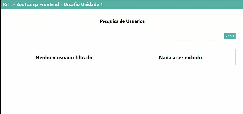

# Desafio Módulo 1

## Bootcamp Frontend - IGTI

Filtro de uma lista de usuarios pré-determinada oriunda do site randomuser com estatísticas atualizadas dinamicamente.

Desenvolvido utilizando html, css e javascript vanilla.

